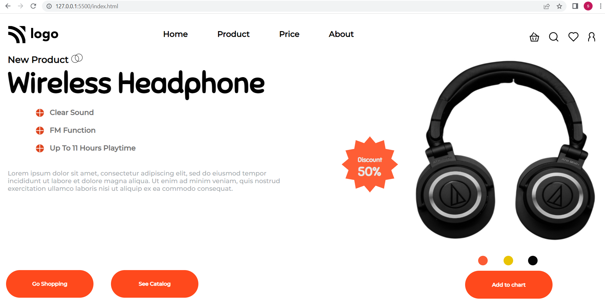

# Project 7

## Project 7 [Live Link]()

-   Skills Gained in this project
    -   Learnd about CSS Position Relative & Absolute

---

## Time taken to finish this project

-   3 hour taken to complete it.

#### Screenshot

